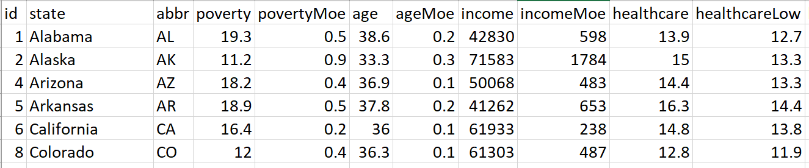
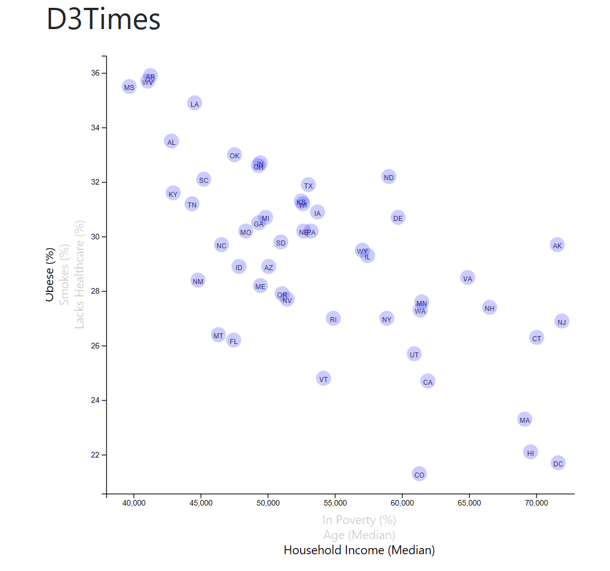
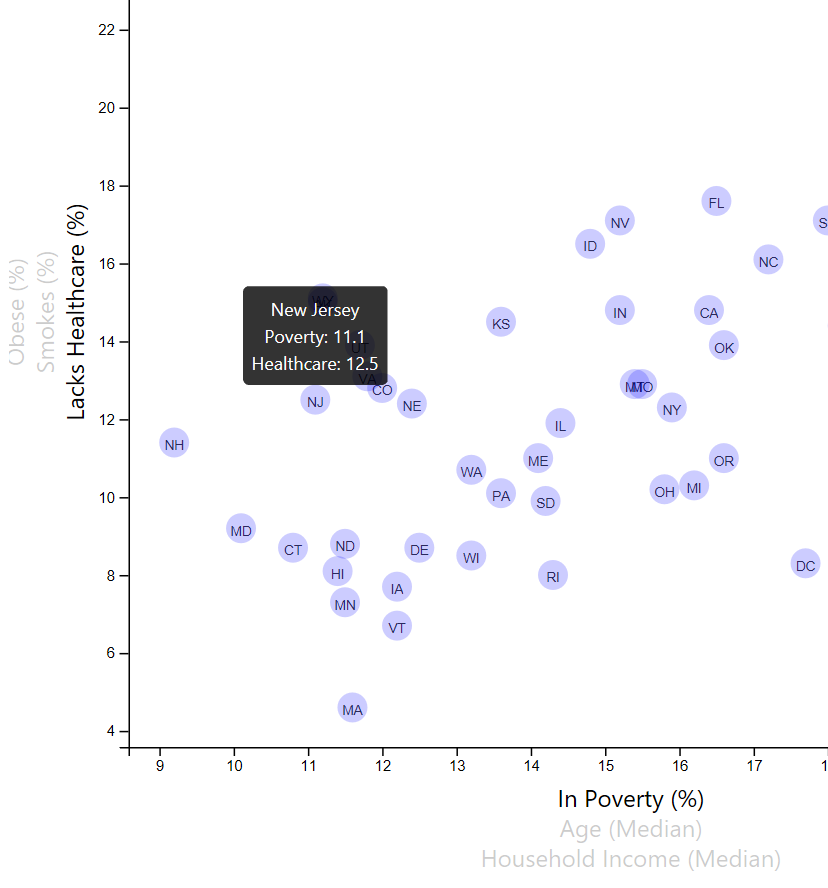

# Data Journalism and D3


## Background

The editor wants to run a series of feature stories about the health risks facing particular demographics. She's counting on you to sniff out the first story idea by sifting through information from the U.S. Census Bureau and the Behavioral Risk Factor Surveillance System.

The data set included with the assignment is based on 2014 ACS 1-year estimates: 



## Plot Chart

### Level 1: D3 Scatter Chart

Create a scatter plot between two of the data variables such as `Healthcare vs. Poverty` or `Smokers vs. Age`.

* Include state abbreviations in the circles.
* Create and situate your axes and labels to the left and bottom of the chart.



- - -

### Level 2: Incorporate d3-tip 

While the ticks on the axes allow us to infer approximate values for each circle, it's impossible to determine the true value without adding another layer of data. Enter tooltips: developers can implement these in their D3 graphics to reveal a specific element's data when the user hovers their cursor over the element. Add tooltips to circles and display each tooltip with the data that the user has selected.



- - -


### Level 3: Apply Animation Effects to the Chart 

Place additional labels in the scatter plot and give them click events so that users can decide which data to display. 
Animate the transitions for circles' locations as well as the range of X & Y axis.

```javascript
function chartAnimator(x, y) {  
    d3.csv("assets/data/data.csv").then((Data) => {
        Data.forEach((data) => {
            data[x] = +data[x];
            data[y] = +data[y];
        });
        
    // Define x axis and y axis range
        var xExtent = d3.extent(Data, d => d[x]);
        var xRange = xExtent[1] - xExtent[0];
        var yExtent = d3.extent(Data, d => d[y]);
        var yRange = yExtent[1] - yExtent[0];

        var xScale = d3.scaleLinear()
            .domain([xExtent[0] - (xRange * 0.05), xExtent[1] + (xRange * 0.05)])
            .range([0, width]);
        var yScale = d3.scaleLinear()
            .domain([yExtent[0] - (yRange * 0.05), yExtent[1] + (yRange * 0.05)])
            .range([height, 0]);

        var bottomAxis = d3.axisBottom(xScale);
        var leftAxis = d3.axisLeft(yScale);

        var duration = 1000
        var radius = 10

        chartGroup.select(".x")
            .transition()
            .duration(duration)
            .call(bottomAxis);
        chartGroup.select(".y")
            .transition()
            .duration(duration)
            .call(leftAxis);  
        
        chartGroup.selectAll("circle")
            .transition()
            .duration(duration)
            .attr("cx", d => xScale(d[x]))
            .attr("cy", d => yScale(d[y]));

        chartGroup.selectAll(".chartText")
            .transition()
            .duration(duration)
            .attr("x", d => xScale(d[x]))
            .attr("y", d => yScale(d[y]) + radius/2);

        tip = d3.tip()
            .attr('class', 'd3-tip')
            .html((d) => { return(d.state + '<br>' + x + ": " + d[x] + "<br>" + y + ": " + d[y]) });
        // vis.call(tip)
        chartGroup.append("g")
            .attr("class", "tip")
            .call(tip);
    });
}
```
------------------------------------------------------
- - -

